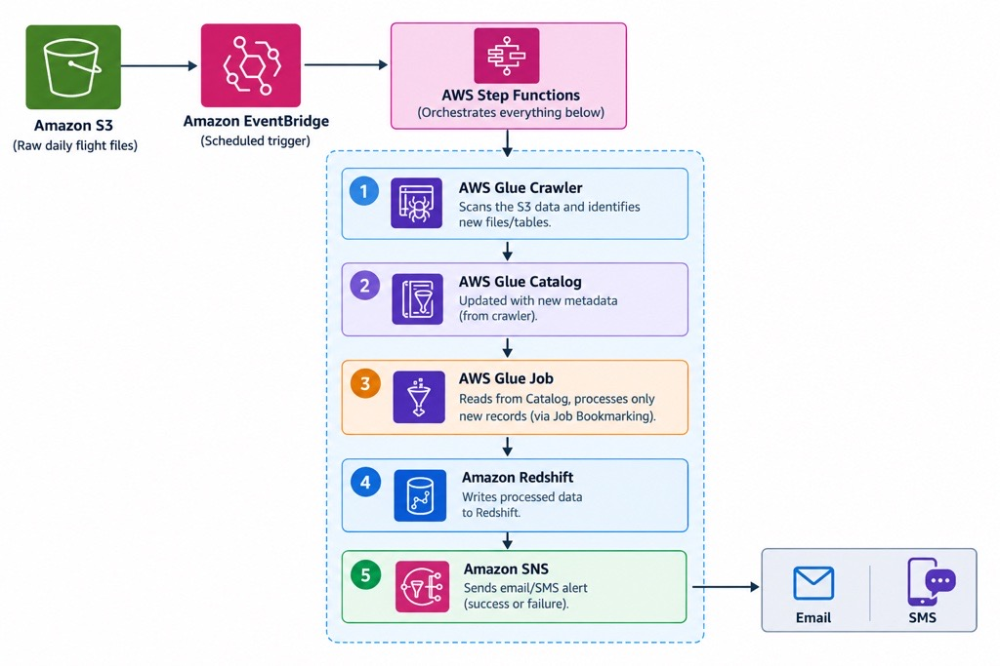

# Airline Data Ingestion Pipeline — Incremental Load on AWS

## Problem Statement

Airlines generate daily flight records capturing a complete
360-degree view of each passenger journey — from departure
airport to arrival airport.
The challenge is to incrementally ingest this daily data
into a Redshift Data Warehouse without reprocessing
historical records, ensuring only new flight records are
loaded each day.

## Architecture

## Tech Stack

- Python, AWS S3, AWS Glue, Glue Crawler, Glue Catalog
- AWS Redshift, Step Functions, EventBridge, SNS

## How It Works

1. Daily flight CSV files land in S3
2. EventBridge triggers Step Function on a defined schedule
3. Glue Crawler scans S3 and updates Glue Catalog
4. Glue Job processes only new records using Job Bookmarking
5. Processed data loaded into Redshift target table
6. SNS sends success/failure notification

## Key Concepts Demonstrated

- Incremental data loading using Glue Job Bookmarking
- Pipeline orchestration with AWS Step Functions
- Schema management via Glue Catalog
- Event-driven automation with EventBridge
- Alerting with AWS SNS
 